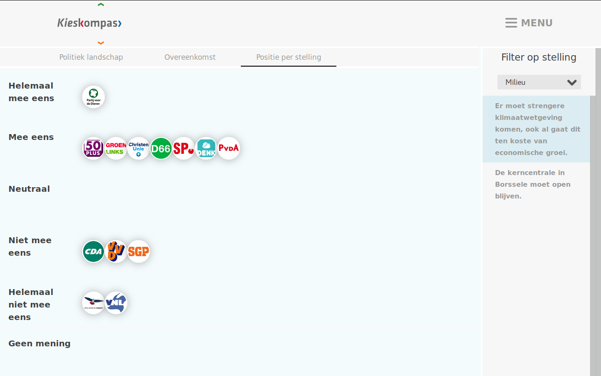

# UI evaluation

This document evaluates the looks and user interface of existing voting platforms.

## Netherlands
The Netherlands has two prominent voting platforms, [Stemwijzer](https://stemwijzer.nl/) and [Kieskompas](https://kieskompas.nl).
The Dutch system is heavily party-oriented, so the voting advice is based on parties and their party line.
The voting is organized in [voting districts](https://nl.wikipedia.org/wiki/Kieskring).
Some parties are only represented in a handful of the 19 Dutch voting districts, and are thereby ignored in the major voting platforms, as only a minority of the Dutch voters can actually vote for these parties.

### Kieskompas

The main page shows a distinct button to start filling in the questions, and a hashtag to use when referring to the platform in social media.
The associated media outlets are featured at the page footer.
The menu on the right opens up, enabling direct navigation all the steps, and a submenu with further details (disclaimer, privacy statement, guide and team).

To enable research and statistics, visitors are requested to fill in personal details, like their age.
This request can be skipped.

Then we get to the questions, 30 in total.
All statements offer 5 levels of agreement (totally agree, agree, neutral, disagree, totally disagree) and a 'no opinion' option.
This interface has a strong focus on the question at hand.

The top menu offers the ability to see the progress, and navigate to other questions, including going back to previous questions.

By hovering over answers the details for that particular question are shown: what the question was, and what you answered.

Having answered all questions, the user is presented with a map of the political landscape first.
This map is the origin of the name 'kieskompas' which means as much as 'voting compass', so to navigate the map of the political landscape.
Most parties have a known generic stance on the axis of left-wing vs right-wing, and conservative vs progressive. As you might expect, left-wing and progressive are correlated, like right-wing and conservative.
The position on the map is shown (not visible in the screenshot), and the party closest by (in the box lower right corner).
The user can deselect some categories of questions, which displaces the location of the parties on the map a bit.

A ranking of similarities is offered as a second visualization.
Again, certain categories can be turned on or off to influence the evaluation.

Lastly the stances of the parties can be evaluated.
On the right hand side a category can be selected, and then a question from that category.
All parties are displayed next to their answer.

### Stemwijzer

The main page is pretty crowded, also highlighting other initiatives the organizers have going, including another voting platform called 'stemmentracker', which is based on the party behavior during the last reign period.

Now we get to the main page we are aiming for.
A short summary of the initiative is provided, and again a link to the other platform.
All represented parties are shown on the side.
One party does not have a formal stance, as it wants to pioneer liquid democracy by having party members vote on what the party should vote.

There is a strong focus on the question at hand.
Three choices are offered (agree, neither, disagree).
Questions can be skipped, which is similar to a 'no opinion' option.
When answering, the stances of parties can be viewed.
The top shows a blue progress bar.

Here the stances of parties are folded out.

Just a small trip to the footer.
Here the main steps of the evaluation process are shown, and navigation is possible.

Having filled in all the questions, one can highlight questions which should be weighed more strongly.

Then the user has to select which parties will be included in the evaluation.
There are predefined selections for 'all parties' and for 'all parties currently in parliament'.

The three most similar parties are finally presented.
For these parties the similarity is shown.
A total list of parties is shown further down the page, where the parties can be selected to take to the next step.
The three most similar parties are preselected.

Based on the previous selection of parties, all questions can be revisited.
The stance of the user is shown, together with the stance of the selected parties.
Other parties, not included in the selection, can be viewed on request.

